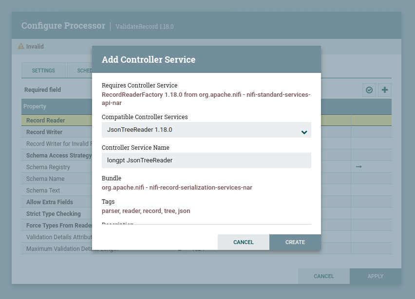

# ConsumeKafka

- 
- ConsumeKafkaRecord vs ConsumeKafka: cái record thì cần phải điền thêm thông tin schema 


- điền các thông tin topic, host, ...


# ValidateRecord

- Record Reader: tạo một cái JsonTreeReader 1.18.0 default



- Record Writer: tạo một cái JsonRecordSetWriter 1.18.0 default
- Record Writer for Invalid Records: set Record Writer ở trên
- Schema Registry: tạo một cái AvroSchemaRegistry 1.18.0


```
trong đây định nghĩa các schema ví dụ hb(1)
{
  "type": "record",
  "name": "hb",
  "fields": [
    {
      "name": "status",
      "type": {
        "type": "int",
        "name": "status"
      }
    },
    {
      "name": "request_time",
      "type": {
        "type": "string",
        "name": "request_time"
      }
    },
    {
      "name": "errors",
      "type": {
        "type": "array",
        "items": "string",
        "name": "errors"
      }
    }, 
    # các trường khác k cần verify thì không cần ghi vào
  ]
}
```
- Schema Name : để mặc định ${schema.name}. biến này sẽ được set ở processor trước đó là hb(1).


- Schema Text : để mặc định ${avro.schema} : 
```
schema sẽ được lấy từ cái registry với name được lấy từ cái ${schema.name} ở trên 
hoặc cũng có thể điền vào nếu có một property ```avro.schema``` set ở processor trước đó 
```

# UpdateAttribute

- vì 2 processor trên không thể set được properties nên các biến như kiểu schema.name, jolt cần được set ở đây 


- biến datetime, .. này sẽ được set cho tất cả các flowfile đi qua đây (chữ i bên trái )


# JoltTransformRecord 


- Record Reader, Record Writer để controller service này giống như lúc set kafka reader 
